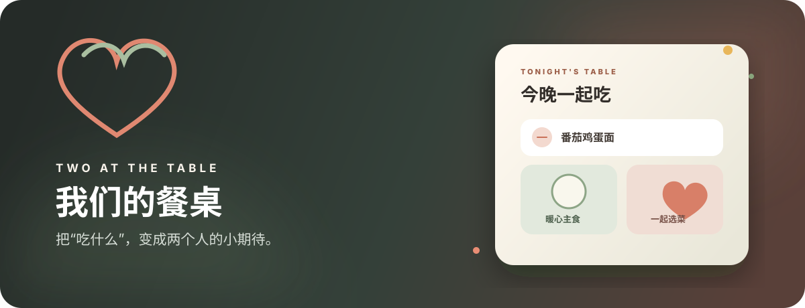
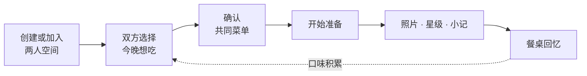
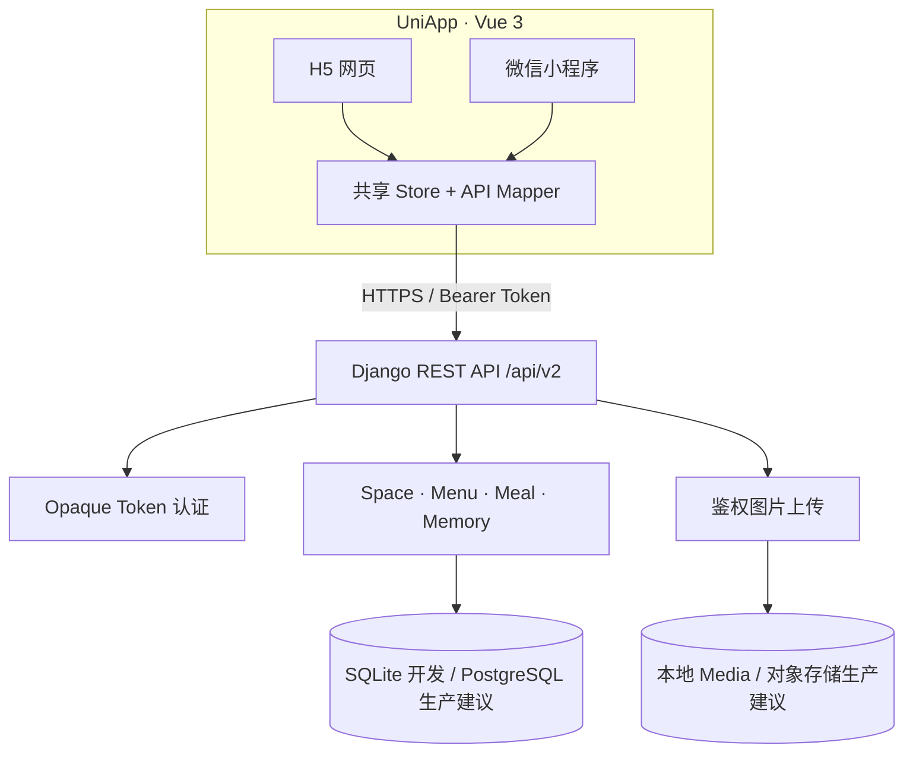

<div align="center">



# 我们的餐桌 · Couple Ordering V2

**一个为两个人设计的共同点餐、私人菜单与餐桌回忆系统。**

[](https://www.djangoproject.com/)
[](https://vuejs.org/)
[](https://uniapp.dcloud.net.cn/)
[](ordering_backend/README_V2.md)

[快速开始](#-快速开始) · [个性化](#-个性化是主角) · [技术架构](#-技术架构) · [微信上线](#-微信小程序上线) · [API 文档](ordering_backend/README_V2.md)

</div>

---

## ✨ 不是外卖商城，是两个人的数字小餐厅

“今晚吃什么？”很小，却每天都会发生。本项目把它设计成一个可以被共同经营的空间：两人表达想吃的菜，一起确认菜单，完成后留下照片、评分与小记。

| 今晚 | 菜单 | 记录 | 我们 |
|---|---|---|---|
| 发起餐次、表达想吃、共同确认 | 管理私房菜、栏目、图片与呈现 | 保存照片、星级、备注和快照 | 情侣空间、邀请、资料、口味与主题 |

## 🎨 个性化是主角

系统首次进入就提供四套主题、三个菜单栏目和八道示例菜，同时允许情侣把几乎每个可见元素改成自己的样子。

- 共享空间：空间名、首页标题、页面背景和导航名称。
- 视觉系统：暖心餐桌、莓果约会、鼠尾草厨房、夜色小馆，可继续调整配色、卡片和圆角。
- 成员资料：每人的昵称、头像、个人口味和爱心/圆环/花朵/像素头像框。
- 菜单工作台：菜单名称、描述、封面，栏目名与强调色，菜品名、故事和照片。
- 图片呈现：满幅、圆角、拍立得和圆形四种风格；无图时使用栏目配色生成高质量占位视觉。

> 自定义通过受控 design tokens 实现，不执行用户提交的 CSS、HTML 或脚本，因此 H5 和小程序可以保持一致与安全。

## 🧩 核心闭环



餐次使用 `draft → confirmed → cooking → completed` 的受控状态机。数据库保证一个空间同时最多只有一个活动餐次，并阻止重复选择。

## 🏗️ 技术架构



### 安全基线

- H5 使用邮箱密码；小程序使用 `wx.login/uni.login` 临时 code。
- AppSecret 只存在服务端；`openid` 不能充当访问令牌。
- 业务 token 仅在签发时返回，服务端保存 SHA-256 摘要，支持过期与撤销。
- 所有空间资源都执行 Membership 对象级隔离。
- 图片只接受真实 JPEG/PNG/WEBP，最大 5 MB，并校验尺寸和空间归属。

### 登录策略

| 端 | 当前方式 | 上线建议 |
|---|---|---|
| 微信小程序 | `uni.login` 获取一次性 code，后端换取 openid 并签发业务 token | 作为主登录方式，不需要邮箱验证码 |
| H5 网页 | 邮箱 + 密码 | 如公开注册，建议增加邮箱验证和忘记密码；内部/小范围使用可暂缓 |

微信身份与微信资料是两件事：`wx.login` 可以不打扰用户地完成身份识别，但不应静默抓取头像和昵称。需要资料时，应在个人资料页使用微信的 `chooseAvatar` 按钮和 `type="nickname"` 输入框，由用户主动选择后再上传保存。即使用户跳过，也不应阻断基本点餐功能。

## 🚀 快速开始

### 1. Django API

```powershell
cd ordering_backend
python -m pip install -r requirements.txt
python manage.py migrate
python manage.py runserver 127.0.0.1:8000
```

### 2. H5

```powershell
cd Uniapp_Odering
npm install
npm run dev:h5
```

### 3. 微信小程序

```powershell
cd Uniapp_Odering
npm install
npm run dev:mp-weixin
```

然后在微信开发者工具中导入 `Uniapp_Odering/dist/dev/mp-weixin`。真机调试前必须将 `VITE_API_BASE_URL` 换成可公网访问的 HTTPS API 域名。

更完整的环境变量、超级管理员和真机配置说明见 [启动指南](启动指南.md)。

## 🧪 质量校验

```powershell
cd ordering_backend
python manage.py check
python manage.py makemigrations --check --dry-run
python manage.py test v2 -v 2

cd ..\Uniapp_Odering
npm run build:h5
npm run build:mp-weixin
```

当前基线：Django 系统检查通过，无迁移漂移，6 项后端集成测试全部通过，H5 与微信小程序生产构建通过。

## 🗂️ 目录

```text
LHB_Ordering/
├── Uniapp_Odering/             # Vue 3 / UniApp，同时输出 H5 和微信小程序
│   ├── pages/v2/              # 登录、引导、主应用、个性化、菜品编辑
│   ├── components/v2/         # 点餐面板、动态导航、回忆弹窗
│   ├── design/               # 主题预设与 design tokens
│   ├── services/api/         # 请求封装与字段映射
│   └── store/                # 跨页状态
├── ordering_backend/
│   ├── ordering_backend/     # Django 配置与路由
│   └── v2/                   # 领域模型、API、认证、管理后台、测试
└── docs/                       # 产品、架构、审阅与迁移文档
```

## 📱 微信小程序上线

仓库已具备小程序构建与微信 code 登录后端。正式上线还需要完成运维与平台环节：

1. 注册并认证微信小程序主体，选择与“工具/生活服务”相符的服务类目。
2. 在 `manifest.json` 替换为自己的 AppID，后端安全配置 `WECHAT_APP_ID/WECHAT_APP_SECRET`。
3. 部署 Django、生产数据库和对象存储，提供已备案且证书有效的 HTTPS 域名。
4. 在微信公众平台配置 request/uploadFile/downloadFile 合法域名。
5. 完成小程序备案、用户隐私保护指引、服务类目和必要资质。
6. 用微信开发者工具上传代码，生成体验版真机回归，再提交审核并发布。

## 📖 文档

- [V2 产品与架构基线](docs/V2_PRODUCT_AND_ARCHITECTURE.md)
- [V2 代码审阅与迁移说明](docs/V2_REVIEW_AND_MIGRATION.md)
- [前后端交互说明](前后端交互说明.md)
- [Django REST API 文档](ordering_backend/README_V2.md)
- [UniApp 前端说明](Uniapp_Odering/README.md)

---

<div align="center">
  <strong>默认即可用，细节全属于你们。</strong>
</div>
